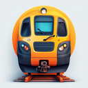

<p align="center">
  
</p>

<h1 align="center">Trenino</h1>
<p align="center"><em>Train Sim World + Arduino · "Model train" in Italian</em></p>

<p align="center">
  <strong>Bridge your custom hardware to Train Sim World</strong>
</p>

<p align="center">
  <a href="#features">Features</a> ·
  <a href="#getting-started">Getting Started</a> ·
  <a href="#supported-hardware">Supported Hardware</a> ·
  <a href="#development">Development</a>
</p>

<p align="center">
  
  
</p>

## Features

**[See Trenino in action!](https://www.youtube.com/watch?v=FcnUJaJU0Wo)**

Build your own train controls with real throttle levers, brake handles, switches, and gauges — then connect them to Train Sim World through a simple desktop app. No programming required. Wire up your Arduino, flash the firmware with one click, and start driving.

- **One-click firmware flashing** — flash Arduino boards directly from the app, no extra software needed
- **Guided calibration** — step-by-step process to calibrate your levers and controls
- **Auto-detection** — automatically recognizes which train you're driving and loads the right configuration
- **Visual control mapping** — map any hardware input to simulator controls using the built-in API explorer
- **Lua scripting** — write custom logic to flash warning LEDs, react to speed changes, automate sequences, and more ([scripting guide](docs/lua-scripting.md))
- **AI-assisted setup** — describe what you want in plain language and let Claude configure your train via [MCP integration](docs/mcp-setup.md)

## Getting Started

### Requirements

- **Train Sim World 6** with the External Interface API enabled (see [below](#enabling-the-tsw-api))
- **An Arduino board** — see [Supported Hardware](#supported-hardware)

### Installation

Download the latest installer for your platform from the [Releases page](https://github.com/albertorestifo/trenino/releases):

- **Windows**: NSIS installer (`.exe`) or MSI — the Visual C++ Redistributable is bundled, no separate install needed
- **Linux**: AppImage (`.AppImage`) — download, mark as executable, and run

macOS builds are not provided as pre-built releases. See the [Development Guide](docs/development.md#building-the-desktop-app) to build from source.

### Enabling the TSW API

Train Sim World 6 ships with an External Interface API for third-party apps. To enable it:

1. Right-click **Train Sim World 6** in Steam → **Properties**
2. In the **General** tab, add `-HTTPAPI` to **Launch Options**
3. Launch the game once to generate the API key

Trenino detects the API key automatically on startup.

## Supported Hardware

| Board | MCU | Analog Inputs | Digital I/O | Status |
|---|---|---|---|---|
| Arduino Nano | ATmega328P | 8 | 14 | Fully tested |
| Arduino Nano (New Bootloader) | ATmega328P | 8 | 14 | Fully tested |
| SparkFun Pro Micro | ATmega32U4 | 12 | 18 | Fully tested |
| Arduino Uno | ATmega328P | 6 | 14 | Supported |
| Arduino Leonardo | ATmega32U4 | 12 | 20 | Supported |
| Arduino Micro | ATmega32U4 | 12 | 20 | Supported |
| Arduino Mega 2560 | ATmega2560 | 16 | 54 | Supported |

All boards can be flashed directly from Trenino.

## Development

```bash
git clone https://github.com/albertorestifo/trenino.git
cd trenino
mix deps.get
mix ecto.setup
mix phx.server
```

Visit [localhost:4000](http://localhost:4000). See the [docs](docs/) folder for architecture and development guides.

## License

[CC BY-NC 4.0](https://creativecommons.org/licenses/by-nc/4.0/) — free to use and modify for non-commercial purposes.
For commercial licensing, contact [alberto@restifo.dev](mailto:alberto@restifo.dev).

## Acknowledgment

Inspired by [MobiFlight](https://www.mobiflight.com/en/index.html).
